# Qualia: Distributed Data Platform
這個專案主要是研究在當代大型系統之上設計一個資料平台，包含一個具有**可擴充性**、**容易部署**、**易於使用**的資料密集型系統。資料庫的歷史發展到現在，已經包含了關聯式資料庫(例如 Postgres, MySQL)、NoSQL(BigTable, Cassandra)、Distributed SQL(Google Spanner, CockraochDB, TiDB, VoltDB)，可以明顯的看到基礎設施的演進已經非常成熟，加上雲端供應商的成熟，使過去需要大量人工的管理成本大大的縮減。

但是對於一家大型企業來說，所需要管理的部門是非常分散的，而且不同部門之間的基礎設施往往各自管理，並且有自己的責任，這導致新的基礎設施專案要取代舊有的系統是非常困難的。所以這個研究專門針對這種情境去設計，利用新發展的技術來擴充原有的系統，可以強化原有系統的效能，也能避免大規模的更動基礎設施。

## Architecture


以上是 Qualia 的系統設計圖，主要設計三個主要的 API，分別是 Cache、Snapshot、Transmitter，在後面的細項會仔細介紹他們的功用。傳統的 3-Tier 架構包含前端、後端以及資料庫，而 Qualia 就是部署在後端和資料庫之間。綠色的框框表示一個部署單位，也就是 Kubernetes 上面的 Pod，最下方的黃色框框則表示就有的資料庫系統。

### Component: Transport
Transport 本身是平台的 API，每一個進入點都是對稱的，所以可以很好的和平衡負載器(Load Balancer)整合。當收到請求的時候，會判斷需要有哪些 Partition 參與，然後將請求發送到 Partition 上面。這層的實作主要是 Protobuf 的定義還有如何使用 Messaging System 發送請求。

### Component: Distributed Cache
Qualia 本身提供 Distributed Cache 的功能，API 只提供最簡單的 ```Get(), Set(), Del()```，開發者可以根據自己的需求選擇如何設定  Key-Value 的 Cache。實作上會先將使用者的 key 做 xxhash，然後用 Messaging System 發起 Request，所有 Local 的 In-Memory Database 都會訂閱自己 Partition 的 Cache Topic，等更新完成之後就可以回應。而當 Cache Miss 的時候使用者可以自己撰寫 Handle Function，去所需要的目標單位更新 Cache，為了避免 Thundering Herd，Go 本身能夠實作 SingleFlight，來避免此問題。

### Component: Transmitter
Qualia 本身就偶解了需要讀寫都訪問原始資料庫的需求，所以主要的讀寫完全可以在平台上執行完畢，我們只需要將讀寫的紀錄用 Messaging System 的 Stream 保留下來，採用異步的的方式寫入 External DB 即可完成。

### Component: Snapshot
Qualia 本身的概念就是用 Stream 組成的中間件，我們可以在平台上實作 Concurrency Control，讓操作的 Record 覆蓋在 External DB 之上。這裡使用 Calvin Deterministic Transaction，當再執行事務時會預先將所有事物排列並且依照順序執行，可以避免 2PC 的 Overhead。實作上，會選定一個 Stream 集中排序 Distributed Transaction，其餘的 Single Partition Transaction 就直接放入所屬的 Stream 執行， Distributed Transaction 則會依照順序一一把需要的分區放入該分區的 Stream。

至於如何把 Event 據合成狀態，則是採取 VLL 這篇論文的實作方式，依照順序一次性的將所有 key 鎖住然後執行，如果中途遇到 Process Failure，只要等待機器重新啟動接續 Stream 游標的位置繼續直行即可。

## How to start Qualia

### Start NATS Cluster

### Start Transport Service

### Start Transmitter Service

### Start Snapshot Service

## NATS General Notes
主要記錄一下 NATS 所支援的語意特性，在開發時可以正確使用。
### QoS
Core NATS 只有提供 At most once，也就是說如果 Consumer 離線的話訊息會直接被燒掉。如果需要 At least once 或 Exactly once 需要啟動 JetStream。

### JetStream Consumer
JetStream Consumer 比較多細節。
#### Pull Consumer

#### Push Consumer
* MaxAckPending: one-to-many 可以設定要多少 Ack 才能夠繼續送訊息，不然就會停止。
* Flow Control

### Sync/Async Subscription
Sync 必須等應用程式回應才能收下一個訊息。Async 則是先設定好 Callback Function，NATS 會 Concurrent 把訊息送出去。注意，其實訊息是 Serially 的被發送，但是並不會等到應用程式端執行完成後才發送下一則。
